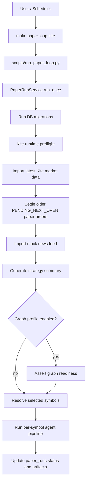
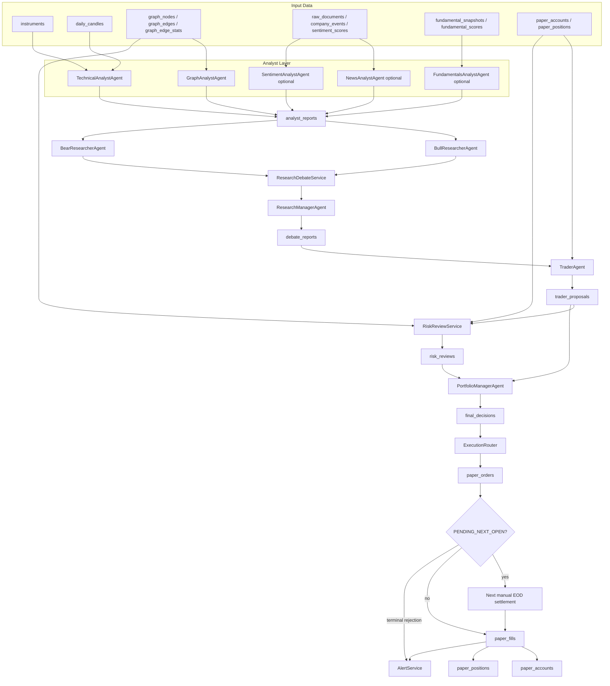
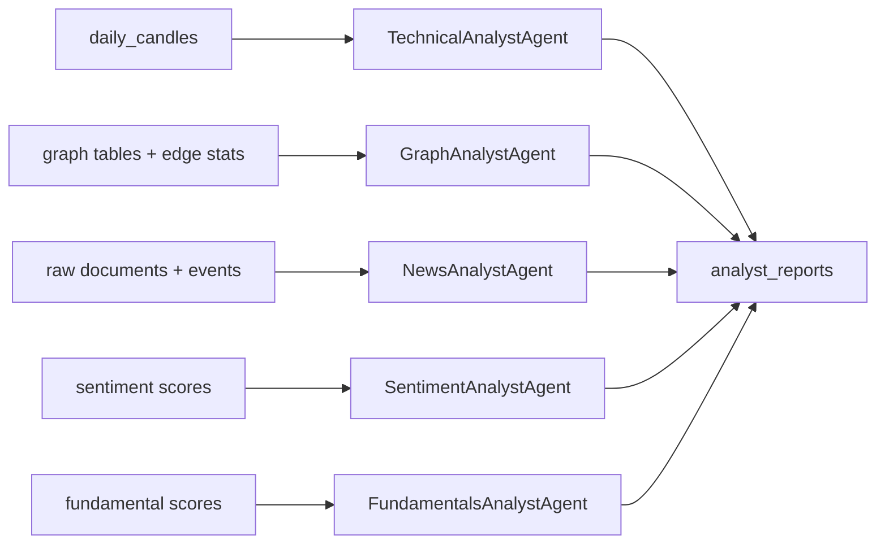
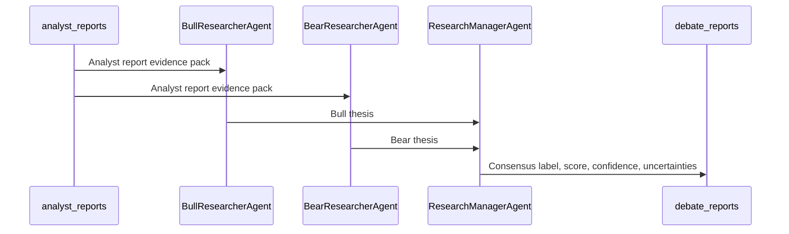
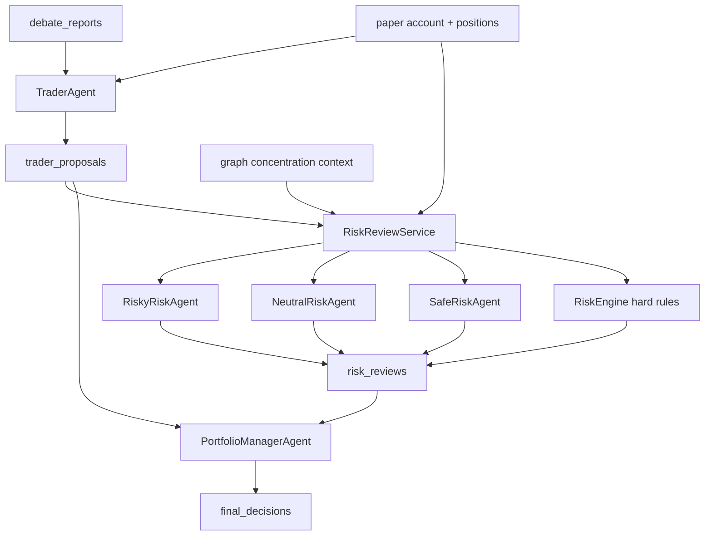
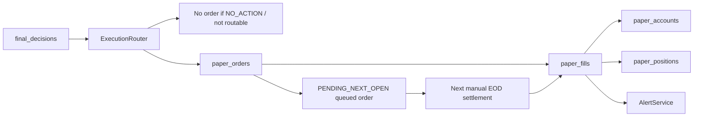

# Taurus Agent Architecture and Data Flow

This document explains the agentic architecture used by the Taurus paper-trading
pipeline. It focuses on what each agent is responsible for, what data it reads,
what artifact it writes, and which downstream agent consumes that artifact.

For table-level storage details, see `docs/TAURUS_DATABASE_TABLES.md`.

## Runtime Entry Point

The canonical graph-enabled paper loop is:

```bash
make paper-loop-kite
```

For a selected symbol set:

```bash
make paper-loop-kite SYMBOLS=INFY,TCS,HFCL,MEDANTA
```

That target runs `scripts/run_paper_loop.py`, which constructs a
`PaperRunService`. The Make target forces the Kite/graph profile:

| Setting | Value |
|---|---|
| `TAURUS_MARKET_DATA_PROVIDER` | `kite` |
| `TAURUS_ENABLED_ANALYSTS` | `technical,graph` |
| `TAURUS_GRAPH_ENABLED` | `true` |
| `TAURUS_GRAPH_RISK_ENABLED` | `true` |
| `STRATEGY` | `configs/strategies/graph_aware_score_v1.yaml` |

The selected paper profile is resolved before paper execution. Make targets use
`TAURUS_PROFILE_ID=local-paper` by default, and
`PROFILE_ID=client-a make paper-loop-kite` selects another active profile.
Profile identity is persisted as `portfolio_id` on paper runs, orders, fills,
accounts, positions, analyst reports, debate reports, trader proposals, risk
reviews, and final decisions. Instruments, candles, Shariah/compliance data,
fundamentals, graph data, Kite credentials, LLM provider settings, alert
configuration, and the web app are shared platform boundaries.

## High-Level Paper Run Flow



## Per-Symbol Agent Pipeline

For each selected symbol, Taurus runs a strict handoff sequence. Each stage
writes a durable artifact before the next stage consumes it.



## Agent Responsibilities and Handoffs

| Stage | Component | Reads | Writes | Hands off to |
|---|---|---|---|---|
| Run orchestration | `PaperRunService` | Settings, requested symbols, current open positions | `paper_runs`, run artifacts | All downstream stages |
| Market-data refresh | Kite provider and importer | Kite API, market-data universe YAML | `instruments`, `instrument_provider_mappings`, `daily_candles` | Strategy and analysts |
| News refresh | `MockNewsProvider` import path | Built-in mock news feed | `raw_documents`, derived news artifacts | Optional news/sentiment agents |
| Strategy summary | Graph-aware strategy | `daily_candles`, graph signals, current positions | Strategy artifacts inside `paper_runs.artifacts` | Per-symbol selection and audit |
| Technical analysis | `TechnicalAnalystAgent` | `daily_candles`, technical features | `analyst_reports` | Research debate |
| Graph analysis | `GraphAnalystAgent` | `graph_nodes`, `graph_edges`, `graph_edge_stats`, related candles | `graph_signals`, `graph_signal_contributions`, `analyst_reports` | Research debate and graph-risk review |
| Optional news analysis | `NewsAnalystAgent` | `raw_documents`, `company_events` | `analyst_reports` | Research debate |
| Optional sentiment analysis | `SentimentAnalystAgent` | `sentiment_scores`, event data | `analyst_reports` | Research debate |
| Optional fundamentals analysis | `FundamentalsAnalystAgent` | `fundamental_snapshots`, `fundamental_scores` | `analyst_reports` | Research debate |
| Bull case | `BullResearcherAgent` | Analyst reports | Bull thesis in debate payload | Research manager |
| Bear case | `BearResearcherAgent` | Analyst reports | Bear thesis in debate payload | Research manager |
| Research synthesis | `ResearchManagerAgent` | Bull thesis, bear thesis, analyst reports | `debate_reports` | Trader |
| Trade proposal | `TraderAgent` | `debate_reports`, current paper positions/account, LLM advisory | `trader_proposals` | Risk review |
| Risk review | `RiskReviewService`, `RiskEngine`, risk personas | Trader proposal, settings, current exposures, graph concentration data | `risk_reviews` | Portfolio manager |
| Final approval | `PortfolioManagerAgent` | Risk review, trader proposal, optional LLM explanation | `final_decisions` | Execution router |
| Paper execution | `ExecutionRouter` and `PaperBroker` | Final decision, latest risk review, market/account state, Kite daily candles | `paper_orders`, `paper_fills`, `paper_accounts`, `paper_positions`, settlement artifacts | Alerts, dashboard, audit |
| Alerts | `AlertService` | Failures, terminal paper fills, and terminal paper rejections | Alert delivery logs/events | Operator |

## Analyst Layer

The analyst layer is parallel in concept, even though the current implementation
stores reports before the research stage proceeds. Each analyst produces the same
artifact shape: an `AnalystReport` with score, confidence, stance, horizon, key
points, risks, source IDs, and model version.



Current `make paper-loop-kite` enables only:

```text
technical,graph
```

The other analysts remain available but are skipped unless
`TAURUS_ENABLED_ANALYSTS` includes them.

## Research Debate Layer

The research layer turns multiple analyst reports into one consensus artifact.
It uses the configured real LLM provider, currently LM Studio with
`qwen/qwq-32b`.

For implementation details on the bull and bear research agents, see
`docs/TAURUS_RESEARCH_DEBATE_AGENTS_DEEP_DIVE.md`.



Responsibilities:

| Agent | Responsibility |
|---|---|
| `BullResearcherAgent` | Produce the strongest evidence-bound bullish thesis from analyst reports. |
| `BearResearcherAgent` | Produce the strongest evidence-bound bearish thesis and risk flags from analyst reports. |
| `ResearchManagerAgent` | Weigh both sides and produce a bounded consensus used by the trader. |

## Trader, Risk, and Final Approval

This layer converts research into a paper-trading decision, but each step is
guardrailed. The LLM can advise and explain, but deterministic lifecycle and risk
rules constrain what can be approved.



Responsibilities:

| Component | Responsibility |
|---|---|
| `TraderAgent` | Converts debate consensus and portfolio lifecycle state into a proposed action such as `BUY`, `NO_TRADE`, `REDUCE`, or `EXIT`. |
| `RiskReviewService` | Coordinates risk personas and hard risk rules. It can approve, reduce, reject, or block a proposal. |
| `RiskEngine` | Applies authoritative hard rules, including position sizing, open-position limits, kill-switch checks, and graph concentration checks when enabled. |
| `RiskyRiskAgent` | Reviews the proposal from a more risk-tolerant perspective. |
| `NeutralRiskAgent` | Reviews the proposal against balanced/default risk constraints. |
| `SafeRiskAgent` | Reviews the proposal conservatively and highlights capital-protection concerns. |
| `PortfolioManagerAgent` | Produces the final paper decision from the risk review and proposal. It controls whether the decision can be sent to paper execution. |

## Execution and Persistence



Execution is paper-only in the current MVP. After-close EOD orders are queued
as `PENDING_NEXT_OPEN` and carry `signal_trade_date`,
`scheduled_fill_session=next_open`, and eventually `filled_trade_date` when a
later manual EOD run settles them against the first newer daily candle open.
Queued orders do not create fills or mutate cash/positions. Terminal settlement
fills or rejections produce one alert per final outcome. Kite remains data-only;
live broker order routing must not be added or broadened without a new explicit
approved milestone.

## Important Design Properties

| Property | Meaning |
|---|---|
| Durable handoffs | Each major agent writes a table-backed artifact before the next agent consumes it. |
| Replayability | Run IDs, decision IDs, source report IDs, and payload JSON make decisions auditable. |
| Deterministic guardrails | LLM output is schema-validated and bounded by deterministic trading/risk rules. |
| Graph-aware profile | `make paper-loop-kite` enables graph analyst, graph readiness, graph-aware strategy, and graph concentration risk. |
| Paper-first safety | Final decisions route only to paper execution unless a later milestone explicitly approves live routing. |
